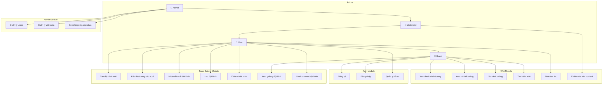
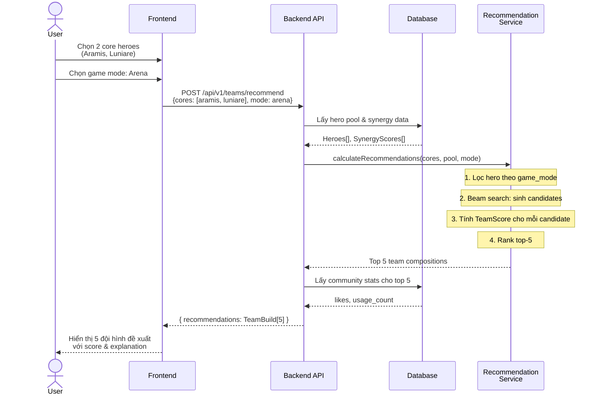
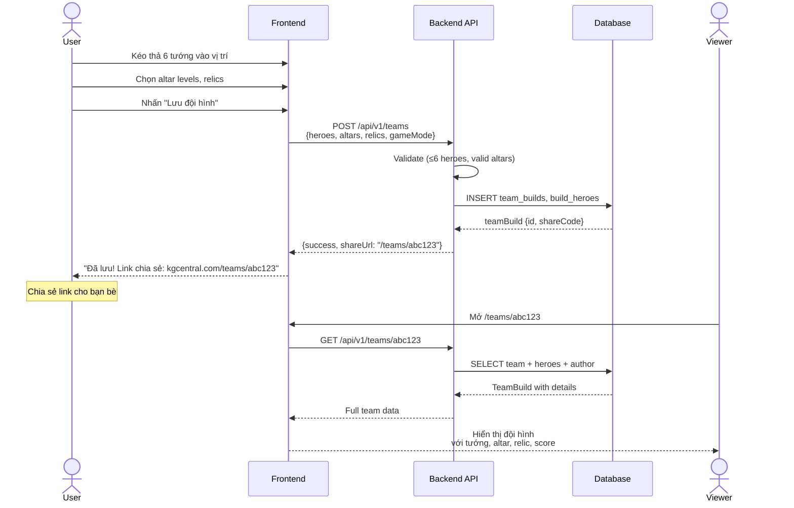
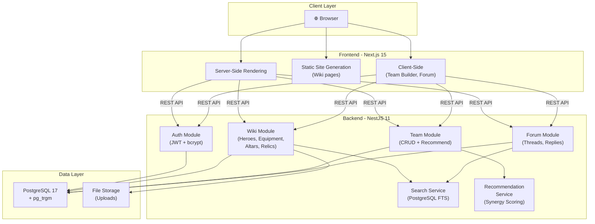
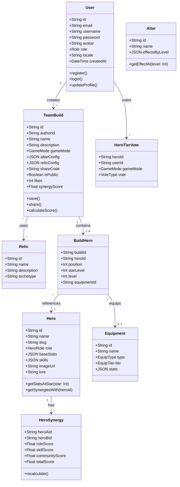
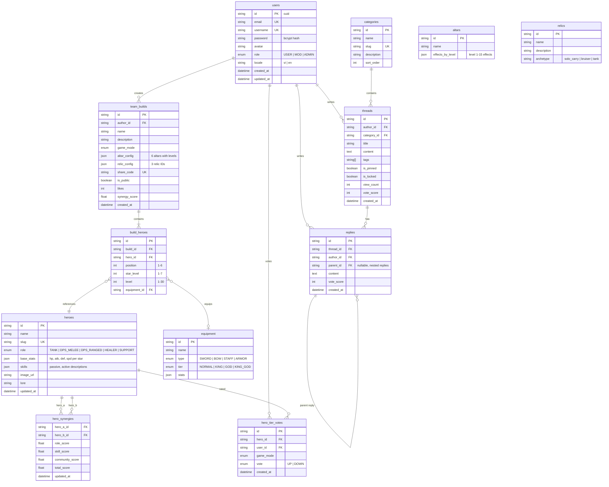

# ĐỒ ÁN TỐT NGHIỆP

Đề tài: Xây dựng website cộng đồng KGCentral tích hợp hệ thống đề xuất đội hình cho game King God Castle

---

## 1. Đặt Vấn Đề

### 1.1. Giới thiệu game King God Castle

**King God Castle** (com.awesomepiece.castle) là game chiến thuật phòng thủ theo phong cách pixel art do **Awesomepiece** phát triển. Game kết hợp cơ chế merge (ghép tướng) với auto-battle chiến thuật, nơi người chơi triển khai và nâng cấp đội hình tối đa **6 tướng** để bảo vệ lâu đài khỏi các đợt tấn công.

**Các yếu tố cốt lõi:**

- **Hệ thống tướng (Heroes):** 60+ tướng với kỹ năng riêng biệt, chia theo vai trò (Tank, DPS melee, DPS ranged, Healer, Support). Mỗi tướng có tối đa 7 sao, level tối đa 30. Stats và skills thay đổi theo star level.
- **Bàn thờ (Altars):** 6 loại (Hero, Blood, Mage, Greed, Giant, Life), mỗi loại tối đa 15 cấp. Ảnh hưởng lớn đến chiến thuật - ví dụ: Altar of Greed + Altar of Heroes là combo phổ biến cho build Aramis carry.
- **Thánh vật (Relics):** 3 slots mỗi đội hình. Quyết định archetype build - Insignia/Mask (solo carry), Armor of Unity/Banner (bruiser), Shield of Gladiator (tanky).
- **Trang bị (Equipment):** 4 cấp bậc (Normal → King → God → King God). Vũ khí: kiếm, cung, gậy. Giáp riêng từng tướng.
- **Chế độ chơi:** Journey (Campaign), Corruption Chapters, Great Rift (roguelike), Arena (PvP), Raids (Solo & Alliance), Tower of Trials, Strife Battlefield.

**Đặc điểm chiến thuật:**

Xây dựng đội hình hiệu quả đòi hỏi kiến thức tổng hợp về **synergy tướng** (hero A buff hero B), **combo altar** (altar nào hỗ trợ archetype nào), **relic phù hợp** (relic quyết định lối chơi), và **vị trí đặt tướng** (front/back row ảnh hưởng targeting). Sự phức tạp này tạo ra nhu cầu lớn về **công cụ hỗ trợ xây dựng đội hình** - vấn đề mà đồ án này hướng tới giải quyết.

### 1.2. Thực trạng cộng đồng

King God Castle có cộng đồng người chơi toàn cầu tích cực, tuy nhiên:

- **Thông tin phân tán:** Wiki trên Fandom thiếu cập nhật, tier list nằm rải rác trên YouTube/Reddit, không có nguồn tập trung.
- **Thiếu công cụ đội hình:** Người chơi phải tự tính toán synergy, không có tool trực quan hỗ trợ - chưa tồn tại Team Builder nào cho game này.
- **Forum riêng không tồn tại:** Thảo luận phụ thuộc Reddit (r/KingGodCastle) và Discord - dễ mất thông tin cũ, khó tìm kiếm bài viết có giá trị.
- **Rào cản ngôn ngữ:** Hầu hết tài liệu bằng tiếng Anh/Hàn, thiếu tài nguyên tiếng Việt.

### 1.3. So sánh giải pháp hiện có (Related Work)

| Tiêu chí | Fandom Wiki | r/KingGodCastle | AllClash | Discord | **KGCentral** |
|----------|:-----------:|:---------------:|:--------:|:-------:|:-------------:|
| Wiki tra cứu tướng | ✅ (thiếu cập nhật) | ❌ | ❌ | ❌ | ✅ |
| Tier list interactive | ❌ | ❌ (chỉ ảnh) | ✅ (bài viết) | ❌ | ✅ (voting) |
| Team Builder tool | ❌ | ❌ | ❌ | ❌ | ✅ |
| Đề xuất đội hình tự động | ❌ | ❌ | ❌ | ❌ | ✅ |
| Forum tìm kiếm được | ❌ | ✅ (hạn chế) | ❌ | ❌ | ✅ |
| Hỗ trợ tiếng Việt | ❌ | ❌ | ❌ | ❌ | ✅ |
| Dark mode | ✅ | ✅ | ❌ | ✅ | ✅ |
| Chia sẻ build qua link | ❌ | ❌ | ❌ | ❌ | ✅ |

**Khoảng trống (gap):** Không có platform nào cung cấp (1) Team Builder tool trực quan với (2) hệ thống đề xuất đội hình dựa trên synergy data, kết hợp (3) wiki đầy đủ trong cùng một nền tảng.

### 1.4. Mục tiêu đề tài

Xây dựng **KGCentral (King God Central)** - website cộng đồng cho game King God Castle, tập trung vào:

1. **Wiki** tra cứu thông tin game đầy đủ, luôn cập nhật.
2. **Team Builder** với hệ thống **đề xuất đội hình tự động** dựa trên thuật toán synergy scoring - **đây là đóng góp kỹ thuật chính của đồ án**.
3. **Forum** thảo luận cộng đồng (mở rộng nếu còn thời gian).
4. **Assets Library** lưu trữ game assets (mở rộng nếu còn thời gian).

---

## 2. Cơ Sở Lý Thuyết

### 2.1. Thuật toán đề xuất đội hình (Team Recommendation)

Đây là **đóng góp kỹ thuật cốt lõi** của đồ án. Hệ thống đề xuất đội hình được xây dựng dựa trên mô hình **Synergy Scoring** kết hợp **Community-weighted Ranking**.

#### 2.1.1. Mô hình Synergy Scoring

Mỗi cặp tướng (Hero_i, Hero_j) có **synergy score** S(i,j) thể hiện mức độ phối hợp hiệu quả khi cùng đội hình.

**Synergy score** được tính dựa trên 3 yếu tố:

```
S(i, j) = α × Role_Compatibility(i, j)
         + β × Skill_Synergy(i, j)
         + γ × Community_Score(i, j)
```

Trong đó:
- **Role_Compatibility(i, j):** Điểm tương thích vai trò. Ví dụ: (Tank + Healer) = cao, (Tank + Tank) = thấp. Được định nghĩa qua **ma trận tương thích vai trò** (Role Compatibility Matrix) 5×5.
- **Skill_Synergy(i, j):** Điểm synergy kỹ năng. Ví dụ: Luniare (link tăng DMG) + Aramis (DPS cần DMG buff) = cao. Được encode dưới dạng **đồ thị synergy** (Synergy Graph) với edge weights.
- **Community_Score(i, j):** Điểm từ dữ liệu cộng đồng - tần suất 2 tướng xuất hiện cùng nhau trong các team builds được đánh giá cao. Cập nhật liên tục theo thời gian.
- **α, β, γ:** Trọng số (α + β + γ = 1), có thể điều chỉnh. Mặc định: α=0.3, β=0.4, γ=0.3.

**Tổng Synergy Score** của một đội hình T gồm 6 tướng:

```
TeamScore(T) = Σ S(i, j) ∀ (i, j) ∈ T, i < j
             + AltarBonus(T, altars)
             + RelicBonus(T, relics)
```

- **AltarBonus:** Điểm cộng thêm khi altar phù hợp với archetype đội hình.
- **RelicBonus:** Điểm cộng thêm khi relic phù hợp.

#### 2.1.2. Thuật toán đề xuất

Khi người chơi chọn 1–3 tướng "core", hệ thống đề xuất các tướng còn lại:

```
Input:  core_heroes (1-3 tướng người dùng chọn)
        game_mode (Arena / Raid / Journey...)
        constraints (altar preferences, relic preferences)

Output: top_k team compositions (k=5), ranked by TeamScore

Algorithm:
1. Lọc hero pool theo game_mode compatibility
2. Generate candidate teams (lấp đầy 6 slots từ core_heroes)
   - Constraint: ít nhất 1 Tank, ít nhất 1 Healer/Support
   - Constraint: không trùng role quá 3 tướng
3. Tính TeamScore cho mỗi candidate
4. Rank & return top-k results
```

Do tổ hợp C(60, 3-5) có thể lớn, sử dụng **greedy heuristic** (chọn tướng tiếp theo có synergy score cao nhất với tướng đã chọn) kết hợp **beam search** (giữ top-B candidates ở mỗi bước) để giới hạn không gian tìm kiếm.

#### 2.1.3. Wilson Score cho Tier List Voting

Thay vì xếp hạng tướng đơn thuần bằng tổng upvotes, áp dụng **Wilson Score Interval** (lower bound) - thuật toán được sử dụng bởi Reddit và Yelp:

```
Wilson_Score = (p̂ + z²/2n - z√(p̂(1-p̂)/n + z²/4n²)) / (1 + z²/n)
```

Trong đó:
- p̂ = upvotes / (upvotes + downvotes)
- n = tổng số votes
- z = 1.96 (95% confidence interval)

Ưu điểm so với "tổng upvotes": tướng có 9/10 upvotes sẽ xếp trên tướng có 50/100 upvotes, dù tổng votes ít hơn → công bằng hơn với tướng ít người biết đến.

### 2.2. Full-text Search

Wiki và Forum cần tìm kiếm nhanh và chính xác. Sử dụng **PostgreSQL tsvector** cho full-text search:

- **tsvector**: chuyển đổi text thành dạng token có trọng số (A > B > C > D).
- **tsquery**: parse search query kết hợp toán tử AND, OR, NOT.
- **GIN index**: index chuyên dụng cho tsvector, tối ưu tốc độ.
- **Fuzzy matching**: Kết hợp `pg_trgm` extension cho tìm kiếm gần đúng (typo tolerance) - quan trọng khi tên tướng phức tạp (Aenrath, Zupitere, Leonhardt).

### 2.3. Kiến trúc Monorepo

Áp dụng mô hình **monorepo** với workspace management, cho phép:
- **Code sharing**: types, config, UI components dùng chung giữa frontend và backend.
- **Atomic changes**: thay đổi shared type ảnh hưởng cả FE/BE được phát hiện tại build time.
- **Parallel builds**: Turborepo cache & parallel execution giảm thời gian build.

---

## 3. Phạm Vi Đề Tài

### 3.1. Phạm vi chính (bắt buộc hoàn thành)

| Module | Nội dung |
|--------|----------|
| **Wiki** | CRUD tướng/trang bị/altar/relic, trang chi tiết, bộ lọc, so sánh, search, tier list voting (Wilson Score), SEO |
| **Team Builder** | Drag-and-drop UI, chọn altar/relic, lưu/chia sẻ build, **đề xuất đội hình tự động** (Synergy Scoring), gallery cộng đồng |
| **Auth & User** | Đăng ký/đăng nhập (JWT + bcrypt), profile, phân quyền (User/Mod/Admin) |
| **Hạ tầng** | Monorepo, Docker, i18n (vi/en), dark/light mode, responsive |

### 3.2. Phạm vi mở rộng (nếu còn thời gian)

| Module | Nội dung |
|--------|----------|
| **Forum** | Categories, threads, replies, voting, search, moderation |
| **Assets Library** | Upload, lưu trữ, preview, download game assets |

### 3.3. Ngoài phạm vi

- Game client / emulator.
- Real-time chat.
- Mobile app native (chỉ responsive web).
- Tích hợp API chính thức của game (game không cung cấp public API).
- Training ML model - sử dụng rule-based scoring + community data.

---

## 4. Phân Tích Yêu Cầu

### 4.1. Yêu cầu chức năng

#### 4.1.1. Use Case Diagram



#### 4.1.2. Sequence Diagram - Đề xuất đội hình



#### 4.1.3. Sequence Diagram - Tạo và chia sẻ đội hình



### 4.2. Yêu cầu phi chức năng

| Tiêu chí | Yêu cầu | Giải pháp |
|----------|---------|-----------|
| **Performance** | Trang wiki load < 2s, API response < 500ms | SSG cho wiki pages, database indexing, caching |
| **SEO** | Wiki pages được Google index | Next.js SSG/SSR, semantic HTML, meta tags, sitemap.xml |
| **Security** | Chống XSS, CSRF, SQL injection, brute-force | Sanitize input (DOMPurify), CSRF token, Prisma (parameterized queries), rate limiting |
| **Accessibility** | WCAG 2.1 Level AA cơ bản | Semantic HTML, aria-labels, keyboard navigation (shadcn/ui tích hợp sẵn) |
| **Scalability** | Hỗ trợ tối thiểu 100 concurrent users | Connection pooling (Prisma), static generation, CDN-ready assets |
| **Responsive** | Desktop + Mobile | Mobile-first CSS, responsive layouts |
| **i18n** | Hỗ trợ vi/en | i18next, content localization |
| **Availability** | Uptime > 99% khi deploy | Docker health checks, restart policies |

---

## 5. Thiết Kế Hệ Thống

### 5.1. Kiến trúc tổng quan



### 5.2. Cấu trúc Monorepo

```
KGCentral/
├── apps/
│   ├── frontend/                # Next.js 15 (App Router)
│   │   └── src/
│   │       ├── app/             # Routes (wiki, teams, forum, auth)
│   │       ├── components/      # UI components
│   │       └── lib/             # Utilities, API client
│   └── backend/                 # NestJS 11
│       └── src/
│           ├── auth/            # AuthModule (JWT, bcrypt, guards)
│           ├── wiki/            # WikiModule (heroes, equipment...)
│           ├── teams/           # TeamModule (CRUD, recommend)
│           ├── forum/           # ForumModule (threads, replies)
│           ├── search/          # SearchService (FTS)
│           └── recommend/       # RecommendationService (synergy)
├── packages/
│   ├── config/                  # Shared config
│   ├── database/                # Prisma ORM
│   ├── i18n/                    # Đa ngôn ngữ
│   ├── types/                   # Shared TypeScript types
│   └── ui/                      # Design system (shadcn/ui)
└── devops/
    └── docker/                  # Dockerfiles
```

### 5.3. Class Diagram - Core Domain



### 5.4. Cơ sở dữ liệu

#### 5.4.1. ER Diagram



#### 5.4.2. Indexing Strategy

| Bảng | Index | Loại | Mục đích |
|------|-------|------|----------|
| `heroes` | `slug` | UNIQUE | URL lookup |
| `heroes` | `name, lore` | GIN (tsvector) | Full-text search |
| `hero_synergies` | `(hero_a_id, hero_b_id)` | UNIQUE composite | Synergy lookup |
| `team_builds` | `share_code` | UNIQUE | Shareable URL |
| `team_builds` | `author_id, game_mode` | B-tree | Filtering |
| `hero_tier_votes` | `(hero_id, user_id, game_mode)` | UNIQUE | Prevent duplicate votes |
| `threads` | `title, content` | GIN (tsvector) | Forum search |
| `threads` | `category_id, created_at` | B-tree | Listing |

---

## 6. Công Nghệ Sử Dụng

### 6.1. Bảng tổng hợp

| Layer | Công nghệ | Phiên bản | Vai trò |
|-------|-----------|-----------|---------|
| Frontend | Next.js | 15.x | SSR/SSG framework |
| | React | 19.x | UI library |
| | Tailwind CSS | 4.x | CSS framework |
| | shadcn/ui | 4.x | Accessible component library |
| | next-themes | 0.4.x | Dark/light mode |
| | i18next | 24.x | Đa ngôn ngữ |
| Backend | NestJS | 11.x | REST API framework |
| | Prisma | 6.x | ORM (type-safe) |
| | Zod | 3.x | Validation |
| | bcrypt | - | Password hashing |
| | jsonwebtoken | - | JWT auth |
| Database | PostgreSQL | 17.x | RDBMS + FTS |
| | pg_trgm | - | Fuzzy search extension |
| DevOps | Docker | - | Containerization |
| | Turborepo | 2.4.x | Monorepo build system |
| | Biome | 2.4.x | Linting & formatting |
| | pnpm | 9.x | Package manager |

### 6.2. Lý do chọn công nghệ

- **Next.js 15 (SSG)**: Wiki pages cần SEO - SSG pre-render tại build time → Google index được, load nhanh. Team Builder cần interactivity → Client Components.
- **NestJS (Modules + DI)**: Kiến trúc module tách biệt Wiki/Teams/Forum/Auth, mỗi module có controller + service + repository riêng. Dependency Injection (DI) giúp RecommendationService inject được vào TeamService dễ dàng.
- **PostgreSQL (FTS + pg_trgm)**: Full-text search tích hợp - không cần thêm Elasticsearch. `pg_trgm` cho fuzzy search tên tướng. JSON columns cho flexible game data (hero stats thay đổi theo star level).
- **Prisma**: Auto-generate TypeScript types từ schema → type-safe queries → giảm bugs runtime. Migration system tốt.
- **shadcn/ui**: Accessible (WCAG), customizable (copy-paste components, không lock-in), dark mode sẵn. Phù hợp gaming website cần custom theming.

---

## 7. Data Pipeline - Nguồn Dữ Liệu Game

### 7.1. Thu thập dữ liệu

Game King God Castle **không có public API**. Dữ liệu game được thu thập từ:

| Nguồn | Dữ liệu | Phương pháp |
|-------|---------|-------------|
| King God Castle Wiki (Fandom) | Hero names, basic skills | Tham khảo + nhập thủ công |
| NamuWiki (tiếng Hàn) | Chi tiết stats, mechanics | Dịch + nhập thủ công |
| In-game observation | Stats theo star level, equipment stats | Chơi game & ghi chép |
| YouTube (King Nob, FosTAtv) | Tier rankings, synergy combos | Phân tích content & encode |
| Reddit / Discord | Community meta, popular builds | Tổng hợp & structured data |

### 7.2. Quy trình seed data

```
1. Thu thập → JSON files (data/heroes.json, data/equipment.json, ...)
2. Validate → Zod schema validation
3. Seed → Prisma seed script (prisma/seed.ts)
4. Synergy → Admin tool tính & cập nhật synergy scores
5. Community → Tự động cập nhật community_score khi users tạo builds
```

### 7.3. Cập nhật khi game update

- Wiki data: Admin chỉnh sửa qua admin panel khi game ra balance patch.
- Synergy scores: Tự động recalculate `community_score` component dựa trên team builds mới.
- Tier list: Cộng đồng re-vote → Wilson Score tự động cập nhật ranking.

---

## 8. Giao Diện Dự Kiến

### 8.1. Sitemap

```
KGCentral/
├── / ................................ Trang chủ (builds hot, threads mới)
├── /wiki
│   ├── /wiki/heroes ................. Danh sách tướng (filter & search)
│   ├── /wiki/heroes/:slug ........... Chi tiết tướng
│   ├── /wiki/heroes/compare ......... So sánh tướng
│   ├── /wiki/heroes/tier-list ....... Tier list (community voting)
│   ├── /wiki/equipment .............. Trang bị
│   ├── /wiki/altars ................. Bàn thờ
│   ├── /wiki/relics ................. Thánh vật
│   └── /wiki/guides ................. Hướng dẫn chơi
├── /teams
│   ├── /teams/builder ............... Team Builder (drag-and-drop)
│   ├── /teams/builder?recommend=1 ... + Đề xuất AI
│   ├── /teams/:shareCode ............ Xem đội hình (shared link)
│   └── /teams/gallery ............... Gallery cộng đồng
├── /forum (mở rộng)
│   ├── /forum/:category
│   └── /forum/thread/:id
├── /auth
│   ├── /auth/login
│   └── /auth/register
├── /profile/:username
└── /admin
```

### 8.2. Design Direction

- **Theme:** Dark mode mặc định - phong cách gaming fantasy, pixel art accents.
- **Colors:** Deep purple/navy background, gold/amber accents (lấy từ game aesthetic).
- **Typography:** JetBrains Mono (stats, code), Inter (body text).
- **Layout:** Desktop-first, responsive xuống mobile.
- **Interactions:** Drag-and-drop cho Team Builder, smooth transitions, skeleton loading.

### 8.3. Wireframes

#### 8.3.1. Trang chủ (Homepage)

```
┌─────────────────────────────────────────────────────────────────┐
│  🏰 KGCentral                    [Search]    [VI/EN] [👤 Login] │
├─────────────────────────────────────────────────────────────────┤
│  [Wiki ▼]  [Team Builder]  [Gallery]  [Forum]                   │
├─────────────────────────────────────────────────────────────────┤
│                                                                 │
│   ╔═══════════════════════════════════════════════════════╗     │
│   ║  🎮 KGCentral - Cộng đồng King God Castle            ║     │
│   ║  Wiki • Team Builder • Đề xuất đội hình AI           ║     │
│   ║                                                       ║     │
│   ║  [🔧 Tạo đội hình ngay]    [📖 Xem Wiki]            ║     │
│   ╚═══════════════════════════════════════════════════════╝     │
│                                                                 │
│   ┌─────────────────────┐  ┌─────────────────────┐              │
│   │ 🔥 HOT BUILDS       │  │ 📊 TIER LIST        │              │
│   ├─────────────────────┤  ├─────────────────────┤              │
│   │ ⭐ Aramis Carry     │  │ S: Aramis, Luniare  │              │
│   │    by @player1      │  │ A: Evan, Lyca       │              │
│   │    ❤️ 234  💬 12    │  │ B: Mara, Zuo Yun    │              │
│   │ ⭐ Bruiser Meta     │  │ ...                 │              │
│   │    by @player2      │  │                     │              │
│   └─────────────────────┘  └─────────────────────┘              │
│                                                                 │
└─────────────────────────────────────────────────────────────────┘
```

#### 8.3.2. Wiki - Danh sách tướng

```
┌─────────────────────────────────────────────────────────────────┐
│  Wiki > Heroes                                                  │
├─────────────────────────────────────────────────────────────────┤
│  [🔍 Tìm kiếm tướng...]                                        │
│                                                                 │
│  Filters:  [Role ▼]  [Star ▼]  [Sort: Tier ▼]  [Compare 0/3]  │
├─────────────────────────────────────────────────────────────────┤
│                                                                 │
│  ┌──────────┐ ┌──────────┐ ┌──────────┐ ┌──────────┐           │
│  │  [img]   │ │  [img]   │ │  [img]   │ │  [img]   │           │
│  │ ⭐⭐⭐⭐⭐ │ │ ⭐⭐⭐⭐⭐ │ │ ⭐⭐⭐⭐   │ │ ⭐⭐⭐⭐   │           │
│  │ Aramis   │ │ Luniare  │ │  Evan    │ │  Lyca    │           │
│  │ DPS      │ │ Support  │ │  Tank    │ │ Healer   │           │
│  │ S Tier   │ │ S Tier   │ │ A Tier   │ │ A Tier   │           │
│  │ [☐ So sánh]│ [☐ So sánh]│ [☐ So sánh]│ [☐ So sánh]│          │
│  └──────────┘ └──────────┘ └──────────┘ └──────────┘           │
│                                                                 │
│  ┌──────────┐ ┌──────────┐ ┌──────────┐ ┌──────────┐           │
│  │  ...     │ │  ...     │ │  ...     │ │  ...     │           │
│  └──────────┘ └──────────┘ └──────────┘ └──────────┘           │
│                                                                 │
│  [< Prev]  1  2  3  4  5  [Next >]                             │
└─────────────────────────────────────────────────────────────────┘
```

#### 8.3.3. Wiki - Chi tiết tướng

```
┌─────────────────────────────────────────────────────────────────┐
│  Wiki > Heroes > Aramis                                         │
├─────────────────────────────────────────────────────────────────┤
│                                                                 │
│  ┌────────────┐  ARAMIS                          [Vote Tier]   │
│  │            │  ════════                        [▲ S] [▼]     │
│  │   [Pixel   │  Role: DPS (Ranged)                            │
│  │    Art]    │  Tier: S (Arena) | A (Raid)                    │
│  │            │                                                 │
│  │            │  "The legendary archer who never misses..."    │
│  └────────────┘                                                 │
│                                                                 │
│  ┌─ Stats (7⭐ Lv30) ──────────────────────────────────────┐   │
│  │  HP: 45,230    ATK: 8,450    DEF: 1,230    SPD: 1.2     │   │
│  │  [Xem theo Star level ▼]                                 │   │
│  └──────────────────────────────────────────────────────────┘   │
│                                                                 │
│  ┌─ Skills ────────────────────────────────────────────────┐   │
│  │  🎯 Passive: Precision Shot                              │   │
│  │     Tăng 15% crit damage cho mỗi enemy killed           │   │
│  │                                                          │   │
│  │  ⚔️ Active: Arrow Storm                                  │   │
│  │     Bắn 5 mũi tên vào enemies, mỗi mũi 120% ATK         │   │
│  └──────────────────────────────────────────────────────────┘   │
│                                                                 │
│  ┌─ Synergy tốt ───────────────────────────────────────────┐   │
│  │  [Luniare] +85%  |  [Alberon] +72%  |  [Hansi] +68%     │   │
│  └──────────────────────────────────────────────────────────┘   │
│                                                                 │
│  [➕ Thêm vào Team Builder]    [📤 Chia sẻ]                    │
└─────────────────────────────────────────────────────────────────┘
```

#### 8.3.4. Team Builder (Core Feature)

```
┌─────────────────────────────────────────────────────────────────┐
│  Team Builder                           [💾 Lưu]  [📤 Chia sẻ] │
├─────────────────────────────────────────────────────────────────┤
│                                                                 │
│  ┌─ ĐỘI HÌNH (Kéo thả tướng vào) ──────────────────────────┐   │
│  │                                                          │   │
│  │    ┌─────┐  ┌─────┐  ┌─────┐     FRONT ROW              │   │
│  │    │  1  │  │  2  │  │  3  │                            │   │
│  │    │Evan │  │Mara │  │ [+] │                            │   │
│  │    │Tank │  │Tank │  │     │                            │   │
│  │    └─────┘  └─────┘  └─────┘                            │   │
│  │                                                          │   │
│  │    ┌─────┐  ┌─────┐  ┌─────┐     BACK ROW               │   │
│  │    │  4  │  │  5  │  │  6  │                            │   │
│  │    │Arami│  │Lunia│  │Hansi│                            │   │
│  │    │DPS  │  │Supp │  │Heal │                            │   │
│  │    └─────┘  └─────┘  └─────┘                            │   │
│  │                                                          │   │
│  │  Synergy Score: ████████░░ 82/100                       │   │
│  └──────────────────────────────────────────────────────────┘   │
│                                                                 │
│  ┌─ CẤU HÌNH ──────────────────┐  ┌─ CHỌN TƯỚNG ───────────┐   │
│  │                              │  │ [🔍 Search...]         │   │
│  │  Altars:                     │  │                        │   │
│  │  [Hero ▼] Lv 12              │  │ ┌────┐ ┌────┐ ┌────┐   │   │
│  │  [Greed ▼] Lv 10             │  │ │Lyca│ │Zuo │ │Leon│   │   │
│  │  ...                         │  │ └────┘ └────┘ └────┘   │   │
│  │                              │  │ ┌────┐ ┌────┐ ┌────┐   │   │
│  │  Relics:                     │  │ │Aen │ │Zupi│ │... │   │   │
│  │  [Insignia ▼]                │  │ └────┘ └────┘ └────┘   │   │
│  │  [Mask ▼]                    │  │                        │   │
│  │  [Banner ▼]                  │  │ [Filter: Role ▼]       │   │
│  │                              │  │                        │   │
│  │  Game Mode: [Arena ▼]        │  │                        │   │
│  └──────────────────────────────┘  └────────────────────────┘   │
│                                                                 │
│  [🤖 Đề xuất đội hình tự động]                                 │
│                                                                 │
└─────────────────────────────────────────────────────────────────┘
```

#### 8.3.5. Đề xuất đội hình (AI Recommendation)

```
┌─────────────────────────────────────────────────────────────────┐
│  🤖 Đề xuất đội hình                                    [Đóng] │
├─────────────────────────────────────────────────────────────────┤
│                                                                 │
│  Dựa trên: Aramis (DPS), Luniare (Support)                     │
│  Game mode: Arena                                               │
│                                                                 │
│  ┌─ ĐỀ XUẤT #1 ─────────────────────────── Score: 94/100 ──┐   │
│  │  [Evan] [Mara] [Alberon] | [Aramis] [Luniare] [Hansi]   │   │
│  │                                                          │   │
│  │  📊 Phân tích:                                           │   │
│  │  • Luniare buff +25% DMG cho Aramis (skill synergy)     │   │
│  │  • 2 Tank front row bảo vệ backline                     │   │
│  │  • Hansi heal bù thiếu sustain                          │   │
│  │                                                          │   │
│  │  👥 Cộng đồng: 234 người dùng build tương tự            │   │
│  │                                                          │   │
│  │  [✓ Áp dụng đội hình này]                               │   │
│  └──────────────────────────────────────────────────────────┘   │
│                                                                 │
│  ┌─ ĐỀ XUẤT #2 ─────────────────────────── Score: 89/100 ──┐   │
│  │  [Leonhardt] [Zuo Yun] [...] | [Aramis] [Luniare] [...] │   │
│  │  ...                                                     │   │
│  └──────────────────────────────────────────────────────────┘   │
│                                                                 │
│  [Xem thêm 3 đề xuất khác...]                                  │
│                                                                 │
└─────────────────────────────────────────────────────────────────┘
```

#### 8.3.6. Mobile Responsive - Team Builder

```
┌─────────────────────┐
│ 🏰 KGCentral    [≡] │
├─────────────────────┤
│ Team Builder        │
├─────────────────────┤
│                     │
│  ┌─────┐ ┌─────┐   │
│  │Evan │ │Mara │   │
│  └─────┘ └─────┘   │
│       ┌─────┐      │
│       │ [+] │      │
│       └─────┘      │
│  ┌─────┐ ┌─────┐   │
│  │Arami│ │Lunia│   │
│  └─────┘ └─────┘   │
│       ┌─────┐      │
│       │Hansi│      │
│       └─────┘      │
│                     │
│ Score: ████░░ 82   │
│                     │
│ [Cấu hình ▼]       │
│                     │
│ ┌───┐┌───┐┌───┐    │
│ │Lyc││Zuo││Leo│    │
│ └───┘└───┘└───┘    │
│ [Xem thêm...]      │
│                     │
│ [🤖 Đề xuất AI]    │
│ [💾 Lưu] [📤 Share]│
└─────────────────────┘
```

---

## 9. Kế Hoạch Thực Hiện

| Giai đoạn | Tuần | Nội dung | Deliverable |
|-----------|------|----------|-------------|
| **1. Phân tích & Thiết kế** | 1–2 | Thu thập game data, thiết kế CSDL, wireframe UI | ERD, wireframes, game data JSON |
| **2. Hạ tầng** | 3–4 | Monorepo, shared pkgs, Docker, Auth (JWT + bcrypt) | Running dev env, login/register |
| **3. Wiki Backend** | 5–6 | CRUD heroes/equipment/altars/relics, FTS, seeding | API endpoints, seeded data |
| **4. Wiki Frontend** | 7–8 | Hero list, detail page, compare, tier list voting | SSG wiki pages, Wilson Score |
| **5. Team Builder** | 9–11 | Drag-and-drop UI, save/share, gallery | Working Team Builder |
| **6. Recommendation** | 12–13 | Synergy scoring, beam search, đề xuất UI | Team recommendation feature |
| **7. Forum** (mở rộng) | 14–15 | Categories, threads, replies, search | Basic forum |
| **8. Polish & Testing** | 16–17 | i18n, responsive, dark mode, unit tests, usability test | Tested application |
| **9. Hoàn thiện** | 18–20 | Viết báo cáo, benchmark, demo | Báo cáo + demo |

---

## 10. Phân Tích Rủi Ro

### 10.1. Bảng đánh giá rủi ro

| ID | Rủi ro | Xác suất | Tác động | Mức độ | Phương án giảm thiểu | Phương án dự phòng |
|----|--------|----------|----------|--------|----------------------|-------------------|
| R1 | **Game update làm thay đổi meta** - Balance patch mới khiến synergy data outdated | Cao | Trung bình | 🟡 | Thiết kế data model linh hoạt, admin panel dễ cập nhật | Cộng đồng có thể vote lại tier list, community_score tự cập nhật |
| R2 | **Thiếu game data** - Không thu thập đủ stats chi tiết cho 60+ heroes | Trung bình | Cao | 🟡 | Bắt đầu data collection sớm (tuần 1-2), ưu tiên heroes phổ biến | MVP với 30 heroes core, mở rộng dần |
| R3 | **Thuật toán đề xuất không chính xác** - Đề xuất không match meta thực tế | Trung bình | Cao | 🟡 | Tune trọng số α,β,γ dựa trên feedback, kết hợp community data | Hiển thị disclaimer "đề xuất tham khảo", cho user override |
| R4 | **Performance chậm với beam search** - Tính toán lâu khi hero pool lớn | Thấp | Trung bình | 🟢 | Precompute synergy matrix, cache kết quả phổ biến | Giảm beam width, limit hero pool theo game mode |
| R5 | **Awesomepiece yêu cầu gỡ bỏ** - Vấn đề bản quyền game assets | Thấp | Cao | 🟡 | Ghi rõ disclaimer fan project, không thương mại | Thay thế bằng placeholder art, giữ logic |
| R6 | **Không đủ thời gian hoàn thành** - Scope quá lớn cho 20 tuần | Trung bình | Cao | 🔴 | Tách rõ scope bắt buộc vs mở rộng, theo dõi tiến độ hàng tuần | Cắt Forum module, focus Wiki + Team Builder |
| R7 | **Thiếu người dùng test** - Không tìm đủ 8-10 KGC players | Thấp | Trung bình | 🟢 | Liên hệ Discord/Reddit community sớm | Test với 5 người, bổ sung online survey |

### 10.2. Ma trận rủi ro

```
                    TÁC ĐỘNG
              Thấp    Trung bình    Cao
         ┌─────────┬─────────────┬─────────┐
    Cao  │         │     R1      │         │
         ├─────────┼─────────────┼─────────┤
Xác suất │         │     R4      │  R2,R3  │
 Trung   │         │             │   R6    │
  bình   ├─────────┼─────────────┼─────────┤
         │         │     R7      │   R5    │
   Thấp  │         │             │         │
         └─────────┴─────────────┴─────────┘
```

### 10.3. Kế hoạch ứng phó rủi ro cao (R6)

**Rủi ro R6: Không đủ thời gian hoàn thành** - được đánh giá mức độ 🔴 (cao nhất)

**Triggers** (dấu hiệu cần hành động):
- Tuần 8 chưa hoàn thành Wiki Frontend
- Tuần 11 chưa có Team Builder working
- Tuần 14 chưa bắt đầu Recommendation

**Escalation plan**:

| Trigger | Hành động |
|---------|-----------|
| Trễ 1-2 tuần | Tăng cường làm việc, cắt giảm Forum module |
| Trễ 3-4 tuần | Cắt Tier List voting, giữ static tier từ data |
| Trễ > 4 tuần | Đơn giản hóa Recommendation thành rule-based (không beam search), focus hoàn thiện Wiki + Team Builder cơ bản |

**Minimum Viable Product (MVP)** nếu worst case:
- ✅ Wiki: Hero list + detail (không compare, không voting)
- ✅ Team Builder: Drag-drop + save (không gallery)
- ✅ Recommendation: Top-3 đề xuất với rule-based scoring
- ❌ Forum: Bỏ hoàn toàn
- ❌ Wilson Score: Bỏ, dùng static tier

---

## 11. Phương Pháp Đánh Giá

### 10.1. Kiểm thử phần mềm

| Loại test | Công cụ | Phạm vi |
|-----------|---------|---------|
| Unit test | Vitest / Jest | Recommendation Service, Wilson Score, Synergy Score |
| Integration test | Supertest + Prisma | API endpoints (CRUD, auth, search) |
| E2E test | Playwright (nếu kịp) | Luồng tạo team build, đăng ký/đăng nhập |

**Mục tiêu coverage**: ≥ 70% cho core modules (recommend, auth, wiki CRUD).

### 10.2. Đánh giá hiệu năng (Performance Benchmark)

| Metric | Target | Phương pháp đo |
|--------|--------|-----------------|
| Wiki page load (SSG) | < 1.5s | Lighthouse performance score ≥ 85 |
| API response (GET hero) | < 200ms | Artillery / k6 load test |
| API response (recommend) | < 1s | Đo với 60 hero pool |
| Full-text search | < 300ms | PostgreSQL EXPLAIN ANALYZE |
| Concurrent users | 100 users | k6 load test |

### 10.3. Đánh giá người dùng (Usability Testing)

**Phương pháp**: Mời **8–10 người chơi** King God Castle thử nghiệm, sau đó điền khảo sát.

**Tiêu chí đánh giá (thang Likert 1–5):**

1. Wiki có đầy đủ và dễ tra cứu không?
2. Team Builder có dễ sử dụng không?
3. Đề xuất đội hình có hữu ích / hợp lý không?
4. Giao diện có trực quan không?
5. Tốc độ trang web có chấp nhận được không?
6. So với Reddit/Discord/Fandom, bạn có thích dùng KGCentral hơn không?

**Mục tiêu**: Điểm trung bình ≥ 3.5/5.0 trên tất cả tiêu chí.

### 11.4. Đánh giá thuật toán đề xuất

#### 11.4.1. Định nghĩa "Hợp lý" (Relevance Criteria)

Một đội hình đề xuất được coi là **"hợp lý"** khi đáp ứng **ít nhất 4/6** tiêu chí sau:

| # | Tiêu chí | Mô tả | Ví dụ Pass | Ví dụ Fail |
|---|----------|-------|------------|------------|
| 1 | **Role Balance** | Có đủ Tank (≥1), DPS (≥1), Healer/Support (≥1) | 2 Tank, 2 DPS, 1 Heal, 1 Supp | 4 DPS, 1 Tank, 1 Heal |
| 2 | **No Anti-Synergy** | Không có cặp tướng counter nhau | Aramis + Luniare | Tướng A steal buff của B |
| 3 | **Altar Compatibility** | Altar config phù hợp với carry chính | Greed + Hero cho Aramis carry | Blood altar cho full ranged team |
| 4 | **Relic Match** | Relic phù hợp archetype | Insignia cho solo carry | Tank relic cho burst team |
| 5 | **Meta Relevance** | Đội hình xuất hiện trong meta (YouTube/Reddit) hoặc biến thể hợp lý | Aramis carry variant | Full off-meta heroes |
| 6 | **Positional Logic** | Tank ở front, DPS/Healer ở back | Evan, Mara front; Aramis back | Healer ở front row |

#### 11.4.2. Phương pháp đánh giá

**A. Expert Review (Qualitative)**

- **Evaluators**: 5 người chơi KGC experienced (≥6 tháng chơi, rank Diamond+)
- **Test cases**: 20 đội hình đề xuất (4 game modes × 5 core hero combinations)
- **Process**:
  1. Đánh giá từng tiêu chí 1-6 (Pass/Fail)
  2. Đánh dấu "Hợp lý" nếu ≥4/6 Pass
  3. Ghi chú lý do nếu "Không hợp lý"
- **Output**: Relevance Rate = (Số đội hình hợp lý) / 20

**B. Meta Comparison (Quantitative)**

- **Baseline**: Thu thập 50 meta builds từ YouTube (King Nob, FosTAtv) và Reddit top posts
- **Metrics**:
  - **Hero Overlap@k**: % heroes trùng khớp với meta build (k = 4, 5, 6)
  - **Core Match Rate**: % đề xuất chứa đúng core heroes của meta
- **Formula**:
  ```
  Hero_Overlap@6 = |recommended ∩ meta_build| / 6
  Precision@5 = Σ Hero_Overlap@6 / 50  (trung bình trên 50 meta builds)
  ```

**C. A/B User Study (nếu có thời gian)**

- 2 nhóm users: Nhóm A dùng recommendation, Nhóm B tự build
- Đo: Thời gian hoàn thành, satisfaction score, team score cuối cùng

#### 11.4.3. Mục tiêu và ngưỡng chấp nhận

| Metric | Target | Ngưỡng tối thiểu | Ngưỡng xuất sắc |
|--------|--------|------------------|-----------------|
| **Relevance Rate** (Expert) | ≥ 70% | 60% | 85% |
| **Hero Overlap@6** (vs Meta) | ≥ 0.65 | 0.50 | 0.80 |
| **Core Match Rate** | ≥ 80% | 70% | 95% |
| **User Satisfaction** | ≥ 4.0/5.0 | 3.5/5.0 | 4.5/5.0 |

#### 11.4.4. Ví dụ đánh giá cụ thể

**Test case**: Core heroes = [Aramis, Luniare], Game mode = Arena

**Đề xuất của hệ thống**:
```
Front: [Evan, Mara, Alberon]
Back:  [Aramis, Luniare, Hansi]
Altar: Hero Lv12, Greed Lv10
Relic: Insignia, Mask, Banner
```

**Đánh giá**:
| Tiêu chí | Kết quả | Lý do |
|----------|---------|-------|
| Role Balance | ✅ Pass | 2 Tank, 1 DPS, 1 Support, 1 Healer, 1 Bruiser |
| No Anti-Synergy | ✅ Pass | Luniare buff Aramis, không có conflict |
| Altar Compatibility | ✅ Pass | Greed + Hero phù hợp Aramis carry |
| Relic Match | ✅ Pass | Insignia + Mask cho solo carry archetype |
| Meta Relevance | ✅ Pass | Aramis carry là meta build phổ biến |
| Positional Logic | ✅ Pass | Tanks front, DPS + healers back |

**Kết luận**: 6/6 Pass → ✅ **Hợp lý**

---

## 12. Vấn Đề Bản Quyền

- Tất cả game assets (sprites, artwork, tên tướng) thuộc bản quyền của **Awesomepiece Co., Ltd**.
- KGCentral là **fan project phi thương mại**, tạo ra nhằm mục đích học thuật (đồ án tốt nghiệp) và phục vụ cộng đồng.
- Website sẽ ghi rõ: *"KGCentral is a fan-made community site. King God Castle and all related assets are trademarks of Awesomepiece. This site is not affiliated with or endorsed by Awesomepiece."*
- Nếu Awesomepiece yêu cầu gỡ bỏ, sẽ tuân thủ ngay lập tức.

---

## 13. Kết Quả Dự Kiến

### 13.1. Sản phẩm

1. **Website KGCentral** hoàn chỉnh với Wiki + Team Builder (+ Forum nếu kịp).
2. **Hệ thống đề xuất đội hình** dựa trên Synergy Scoring + Community Data.
3. **Cơ sở dữ liệu game** đầy đủ cho 60+ tướng, trang bị, altar, relic.
4. **API documentation** (Swagger/OpenAPI).
5. **Docker images** sẵn sàng deploy.
6. **Báo cáo đánh giá** (benchmark + usability test results).

### 13.2. Đóng góp

| Đóng góp | Chi tiết |
|----------|----------|
| **Thực tiễn** | Nền tảng cộng đồng tập trung đầu tiên cho King God Castle - hiện chưa tồn tại |
| **Kỹ thuật** | Thuật toán đề xuất đội hình bằng **Synergy Scoring + Beam Search** - áp dụng được cho các game chiến thuật tương tự |
| **Kỹ thuật** | Ứng dụng **Wilson Score** cho community-driven tier list - công bằng hơn tổng upvotes |
| **Kỹ thuật** | **Full-text search** tiếng Việt + tiếng Anh trên PostgreSQL với fuzzy matching |
| **Tham khảo** | Mô hình kiến trúc **monorepo fullstack** hiện đại (Next.js + NestJS + Prisma) |

---

## 14. Tài Liệu Tham Khảo

1. King God Castle - Google Play Store. https://play.google.com/store/apps/details?id=com.awesomepiece.castle
2. King God Castle Wiki - Fandom. https://king-god-castle.fandom.com
3. r/KingGodCastle - Reddit. https://reddit.com/r/KingGodCastle
4. E. Miller, "How Not To Sort By Average Rating," 2009. https://www.evanmiller.org/how-not-to-sort-by-average-rating.html *(Wilson Score)*
5. S. Russell and P. Norvig, *Artificial Intelligence: A Modern Approach*, 4th ed. Pearson, 2020. *(Heuristic search, beam search)*
6. Next.js Documentation - https://nextjs.org/docs
7. NestJS Documentation - https://docs.nestjs.com
8. Prisma ORM Documentation - https://www.prisma.io/docs
9. PostgreSQL Full Text Search - https://www.postgresql.org/docs/17/textsearch.html
10. shadcn/ui - https://ui.shadcn.com
11. Turborepo - https://turbo.build

---

> **Sinh viên thực hiện**: _[Họ và tên]_
> **Mã sinh viên**: _[MSSV]_
> **Giáo viên hướng dẫn**: _[Họ và tên GVHD]_
> **Trường / Khoa**: _[Tên trường / khoa]_
> **Năm**: 2026
